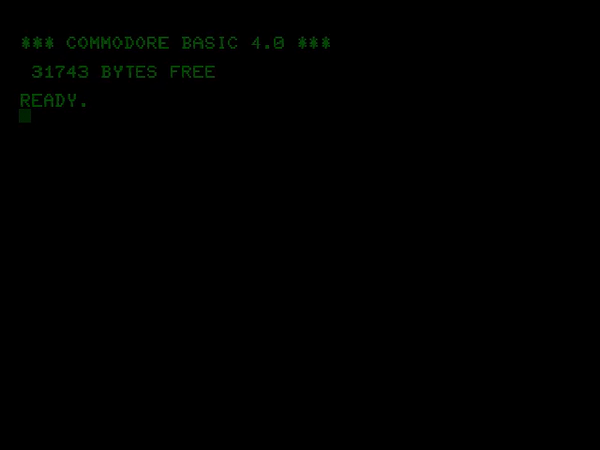
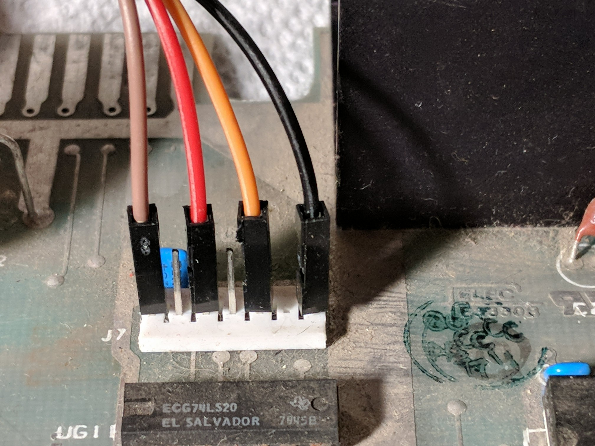
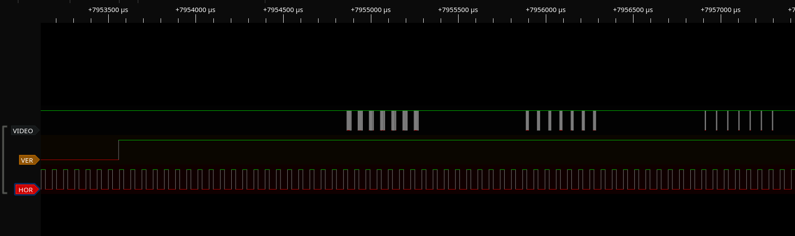

# petvideo
A simple program to emulate the Commodore PET monitor on your PC.
You can hook it up and have the output of the PET displayed in a window like this:



## Why?

PETs are awesome but the fact that they are a "onesie" computer makes it hard to test independently their 
motherboard from their proprietary screens. This piece of software allows you to just hook up a PET motherboard and fix
 it without to be close to a buzzing 10kv device that tries to kill you.

The alternative is to build a composite adapter but it would be a one purpose device while this LA device can also be used for more advance vintage computer troubleshooting!

## What do I need?

All you need a ~$10 fx2lafw compatible USB LA device, see a list of devices [on the sigrok website](https://sigrok.org/wiki/Fx2lafw).

I used [this one from Amazon](https://www.amazon.com/gp/product/B077LSG5P2/ref=ppx_yo_dt_b_asin_title_o02_s00?ie=UTF8&psc=1) (I have no affiliation whatsoever with it).

And connect it like this:

```
LA       PET Connector J7
CH0      Pin 1     [Video]
CH1      Pin 3     [VER Drive]
CH2      Pin 5     [HOR Drive] 
GND      Pin 7     [Gnd]
```

It should look like this...


With here, brown for video, red for vertical drive, yellow for horizontal drive and black for GND.

Starting pulseview, the sigrok graphical client, the signals should look like this:



## Software dependencies

You will need to install:
- [Python 3.8+](https://www.python.org/)
- [libsigrok](https://sigrok.org/wiki/Libsigrok)
- [cython](https://pypi.org/project/Cython/) 
- [pygame](https://pypi.org/project/pygame/)
- [numpy](https://pypi.org/project/numpy/)
- [click](https://pypi.org/project/click/)

If you are on Arch Linux you can install all those dependencies with this command, you will need the community repos to be enabled:
```bash
sudo pacman -S python libsigrok cython python-pygame python-numpy python-click
```

## Usage

You can test the rendering part of the software independently first:
```bash
./petvideo --test
```

To run it for real on the first LA found on your system:
```bash
./petvideo
```

You can ask for a fancy CRT-style rendering with:
```bash
./petvideo --phosphore
```

To see if your system is keeping up you can ask for rendering and decoding statistics:
```bash
./petvideo --fps
```

Other options are available, check out the --help for an updated list:
```bash
./petvideo --help
```


## Theory of operation
This software is shamelessly doing what is called "bitbanging", interpreting an hardware signal purely in software.
The core of the logic is the state machine in vdecode.pyx that is cycling between 5 states:

```
PRE_VBLANK    Waiting state to catch the next vertical blank (start to a screen end the ray is at the top) 
VBLANK        Start of the vertical blank waiting for a line. 
HBLANK        Start of the horizontal blank waiting for pixels to arrive. 
LEFT_LINE     First part of the line when HBLANK is still on
RIGHT_LINE    Second port of the line when HBLANK reset to prepare to trigger for the next line.
```

The signal is only sampled at 12MHz while the device can do 24MHz+ because the USB 2 bandwidth is limited to ~20 MB/s so it cannot keep up at more than 20Mhz.
If some contributors can check with USB3 devices, feel free to post a PR to add their support.

## Creating a capture for the tool
The test sample has been captured like this:
```bash
sigrok-cli -d fx2lafw --continuous -O binary --config samplerate=12m -o test/raw-vid-ver-hor-x-x-x-x-x.raw
```
